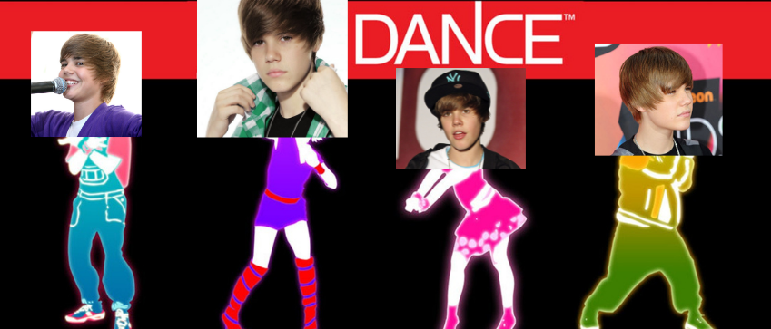
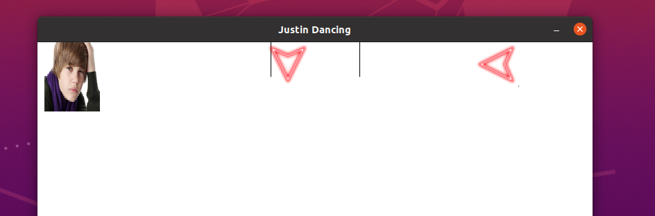

# Justin Dance 
idealizado e feito por Sofhia Souza, Matheus Luís Oliveira, Ana Vitória Freitas e Thiago Cardoso.


### Sobre o jogo
Jogo simples e iterativo baseado no jogo para console Just Dance.

#### Instalando as dependências
Abra uma janela do terminal e digite os seguintes comandos:
```
sudo apt-get install libsdl2-dev
sudo apt-get install libsdl2-image-dev
sudo apt-get install libsdl2-ttf-dev
```

#### Como iniciar o jogo?
Basta ir na raíz do projeto, onde o arquivo `Makefile` está e digitar no terminal `make run`. Uma janela parecida com a seguinte deverá aparecer: 



#### Como jogar?
Conforme o jogo roda, setas vermelhas (mostradas na imagem acima) irão aparecer aleatoriamente, e o objetivo é tentar acertá-las com as teclas correspondentes no seu teclado a medida que elas ficam entre as duas barras indicadas.


### Sobre a implementação
Feito em linguagem `c++` a lógica do jogo foi implementada utilizando amplamente o conceito de *threads*, com o auxílio da biblioteca **pthread.h**. Foi implementada uma thread para cada botão (seta para cima, para baixo, para esquerda e para direita) que verificam se a tecla correspondente no teclado foi clicada ou não. Caso clicada, é preciso verificar o estado da variável `actualState` se está como `VALID` e se houve correspondência entre a seta mostrada na tela e clicada pelo jogador. Caso haja o *match*, a variável actualState passa a ser `INVALID`, ou seja, sai da região crítica, e o ponto para o jogador é contabilizado.
 