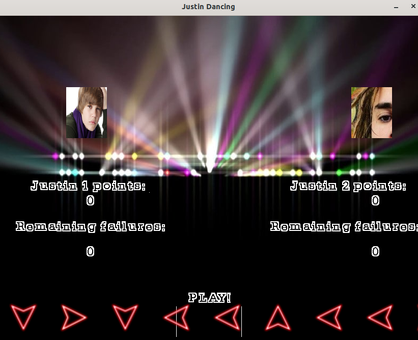

# Justin Dancing
Idealizado e desenvolvido por Sofhia Souza, Matheus Luís Oliveira, Ana Vitória Freitas e Thiago Cardoso, para o curso de Sistemas Operacionais I.


### Sobre o jogo
Jogo simples e iterativo baseado no jogo para console Just Dance.
Foi projetado para ser executado em sistemas Linux e utiliza as bibliotecas [SDL2](https://www.libsdl.org), [SDL2_ttf](https://www.libsdl.org/projects/SDL_ttf/) e [SDL2_image](https://www.libsdl.org/projects/SDL_image/)

#### Instalando as dependências
Abra uma janela do terminal e digite os seguintes comandos:
```
sudo apt-get install libsdl2-dev
sudo apt-get install libsdl2-image-dev
sudo apt-get install libsdl2-ttf-dev
```

#### Como iniciar o jogo?
Baixe o código fonte do projeto usando

```
git clone https://github.com/sofhiasouza/Justin-Dancing.git
```

Para compilar basta ir na raíz do projeto, onde o arquivo `Makefile` está e utilizar o seguinte comando

 ```
 make run
 ```
 
Uma janela parecida com a seguinte deverá aparecer: 



#### Como jogar?
Conforme o jogo roda, setas vermelhas (mostradas na imagem acima) irão aparecer aleatoriamente, e o objetivo é tentar acertá-las com as teclas correspondentes no seu teclado a medida que elas ficam entre as duas barras indicadas. As teclas do jogador 1 são as teclas W(para cima), S (para baixo), A (para a esquerda) e D (para a direita). As teclas do jogador 2 são as teclas de setas do teclado. Vence o jogador que obtiver maior pontuação.


### Sobre a implementação
Feito em linguagem `c++` a lógica do jogo foi implementada utilizando amplamente o conceito de *threads*, com o auxílio da biblioteca **pthread.h**. Foi implementada uma thread para cada botão (seta para cima, para baixo, para esquerda, para direita, A, W, S e D) que verificam se a tecla correspondente no teclado foi clicada ou não. Caso clicada, é preciso verificar se a variável `actualState` do comando atual está como `VALID` e se houve correspondência entre a seta mostrada na tela e clicada pelo jogador. Caso haja o *match*, a variável actualState passa a ser `INVALID`, e o ponto para o jogador é contabilizado. Assim, quando uma thread vai acessar essa variável `actualState`, é utilizado um semáforo para trancar essa região crítica, e destrancá-la assim que deixar de ser acessada.